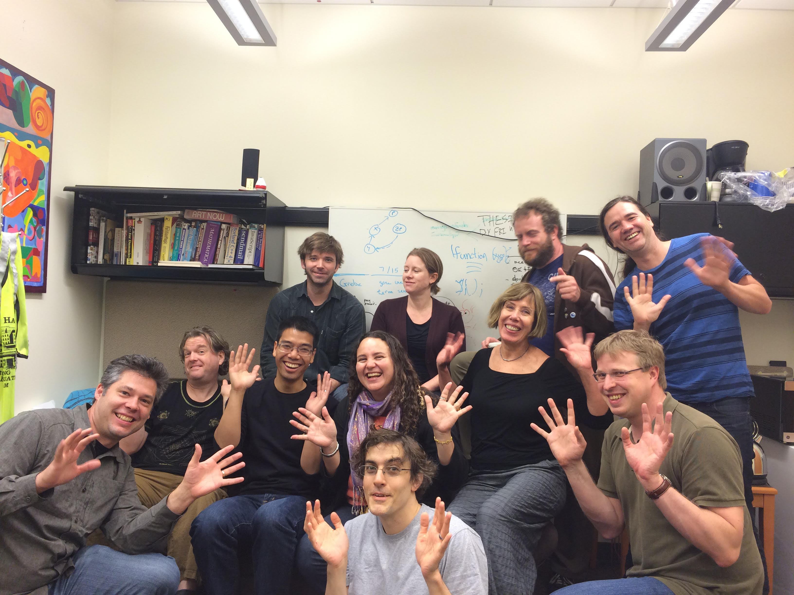

 
 
**Welcome!**

Berkeley Bioinformatics Open-source Projects (BBOP), located at the Lawrence Berkeley National Labs, is a diverse group of scientific researchers and software engineers dedicated to developing tools and applying computational technologies to solve biological problems. Members of the group contribute to a number of projects, including the Gene Ontology, OBO Foundry, the Phenotypic Quality Ontology, modENCODE, and the Generic Model Organism Database Project.

Our group is focused on the development, use, and integration of ontologies into biological data analysis. We invite you to learn more about our projects and people.

