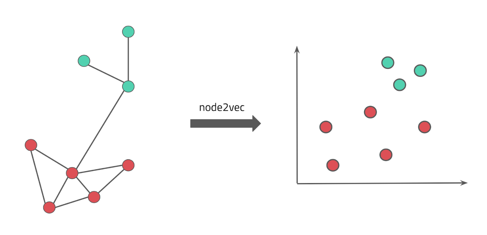

Illuminating the Druggable Genome by Knowledge Graphs (IDG2KG), funded by the NIH as part of the [Illuminating the Druggable Genome](https://commonfund.nih.gov/idg) effort, builds on leading computational resources in biomedicine (including the Monarch Initiative, which is co-led by BBOP PI Chris Mungall) to create a knowledgebase about drugs, proteins and diseases.

LBNL participates as one of the key members of Cutting Edge Informatics Tools (CEIT), in coordination with The Jackson Laboratory and University of New Mexico.

The goal of this project is to create a machine-actionable knowledge graph (KG) that comprises of information about genes, diseases, drugs, and proteins. We then use parts of this KG as input to various machine learning approaches to learn and predict disease-protein associations.
This approach paves the way to forming hypotheses about how to treat diseases. 

Prioritizing novel drug targets is a slow, high-risk process; The IDK2KG project aims to accelerate this critical step in drug development.
