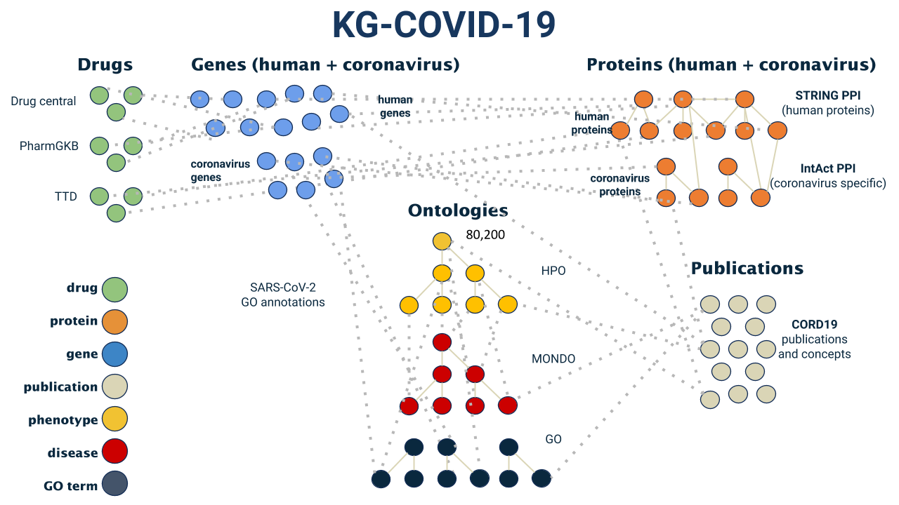
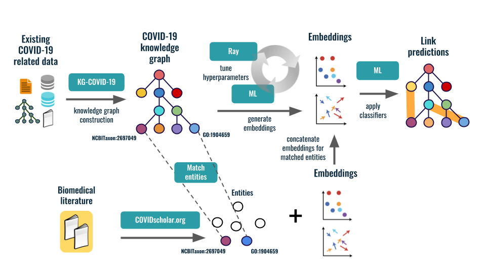

**KG-COVID-19: Knowledge Graph for COVID-19 Response**

Publication:
Reese JT, Unni D, Callahan TJ, Cappelletti L, Ravanmehr V, Carbon S, Shefchek KA, Good BM, Balhoff JP, Fontana T, Blau H, Matentzoglu N, Harris NL, Munoz-Torres MC, Haendel MA, Robinson PN, Joachimiak MP, Mungall CJ.
KG-COVID-19: A Framework to Produce Customized Knowledge Graphs for COVID-19 Response. Patterns (N Y). 2021 Jan 8;2(1):100155. http://dx.doi.org/10.1016/j.patter.2020.100155 PMCID: PMC7649624

The goal of the KG-COVID-19 project is to use Machine Learning (ML) to generate useful
COVID-related knowledge. Rich biological knowledge exists about SARS-CoV-2 and related 
viruses (SARS-CoV, MERS-CoV), for example genomics, epidemiology, susceptibility, 
clinical/symptoms, viral lifecycle, pathways, and inhibitors. However, much of this 
information is either locked in textual form in the literature, or in individual 
siloed databases, making integrative prediction difficult and costly. 

To address this challenge, we produced a COVID-19 knowledge graph
(KG) to support both DOE and international COVID-19 efforts:
https://github.com/Knowledge-Graph-Hub/kg-covid-19/wiki

This knowledge graph incorporates up-to-date data extracted from biomedical databases 
and literature, including drug, protein-protein interactions, SARS-CoV-2 gene 
annotations, concept and publication data from the CORD19 data set. We also ingest
the [Human Phenotype Ontology](https://hpo.jax.org/), [the Gene Ontology](http://geneontology.org/),
 and [Mondo](https://mondo.monarchinitiative.org/) for phenotype, gene 
annotations and diseases, respectively, in order to integrate the data in an
ontology-aware way. 

We applied machine learning (ML) techniques to discover new links 
(for example, identifying existing drugs that could be repurposed to treat COVID-19)
and generate actionable knowledge. In addition, we provided this knowledge graph
to the COVID-19 research community in order to accelerate COVID-19 research.

The LDRD funding for the KG-COVID-19 project ended in 2021, but the software and KG continue to be used in N3C projects to investigate mechanisms of long COVID.
The framework for building KGs that was developed in this project is being used as a building block for constructing other KGs.
For example, in a current project, it is being used to build an integrated KG that includes patient-level data.

People:

- Justin Reese - LBNL
- Deepak Unni - LBNL (now SIB)
- Marcin Joachimiak - LBNL
- Chris Mungall - LBNL 

External Collaborators: 

- Peter Robinson - Jackson Laboratory
- Tiffany Callahan - University of Colorado Denver (now Columbia University)
- Luca Cappelletti - University of Milan
- Vida Ravanmehr - Jackson Laboratory
