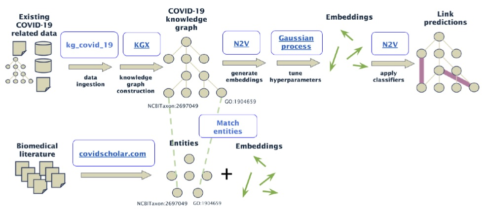

**KG-COVID-19: Knowledge Graph for COVID-19 Response**

The goal of the KG-COVID-19 project is to use Machine Learning (ML) to make useful COVID-related predictions. Rich biological knowledge exists about SARS-CoV-2 and related viruses (SARS-CoV, MERS-CoV), for example genomics, epidemiology, susceptibility, clinical/symptoms, viral lifecycle, pathways, and inhibitors.
However, much of this information is either locked in textual form in the literature, or in individual siloed databases, making integrative prediction difficult and costly.
In this project, we will 1) produce a COVID-19 knowledge graph (KG) to support both DOE and international COVID-19 efforts; 2) incorporate data from COVID-19 biomedical literature in the form of natural language processing (NLP)-derived terms and deep learning embeddings; 3) apply machine learning (ML) techniques to discover new links
(for example, identifying existing drugs that could be repurposed to treat COVID-19) and generate actionable knowledge.

